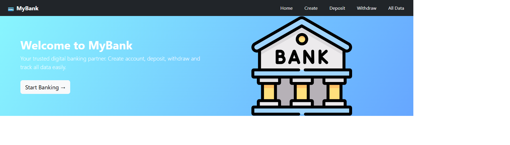

# MyBank - Banking Application

## Description and motivation

MyBank is a simple front-end banking application built as a learning project. It helps users explore common banking flows in one place: creating an account, depositing money, withdrawing money, and viewing account details. The project was built to practice React components, state, and page navigation while modeling basic account and balance management.

This is a demonstration app only. It does not connect to a bank or store data on a server. Account data is kept in React state and is lost when the page is refreshed.

Do not enter real passwords or sensitive financial information. This demo is not secure, and the All Data page displays account details.

## Installation and setup

You need [Node.js](https://nodejs.org/) and npm installed.

1. Clone the repository (replace the placeholder with your repository URL):

   ```bash
   git clone <repository-url>
   ```

2. Change into the project directory:

   ```bash
   cd banking-app
   ```

3. Install dependencies:

   ```bash
   npm install
   ```

4. Start the development server:

   ```bash
   npm start
   ```

5. Open [http://localhost:3000](http://localhost:3000) in your browser.

The project already has a `package.json`, so you do not need to run `npm init`.

## Screenshot

MyBank home page:



## Technology used

- JavaScript
- React 19.2
- React Router 7.13
- Bootstrap 5.3
- Create React App (`react-scripts` 5.0.1)
- HTML and CSS

## Features

- Home page with a link to start creating an account
- Create an account with a name, email, and password
- New accounts start with a balance of ₹1,000
- Deposit money into a selected account
- Withdraw money, with a check against insufficient balance
- View account details and current balances
- Client-side navigation between pages

### Planned improvements

- Persist account and transaction data with a backend and database
- Add secure authentication and authorization
- Validate account details and transaction amounts more thoroughly
- Add transaction history and account-specific summaries
- Improve accessibility and add responsive UI tests

## License

No license is specified in `package.json`, and this project does not currently include a `LICENSE` file. Therefore, no open-source license is declared. Choose and add a license before distributing or reusing the project.
